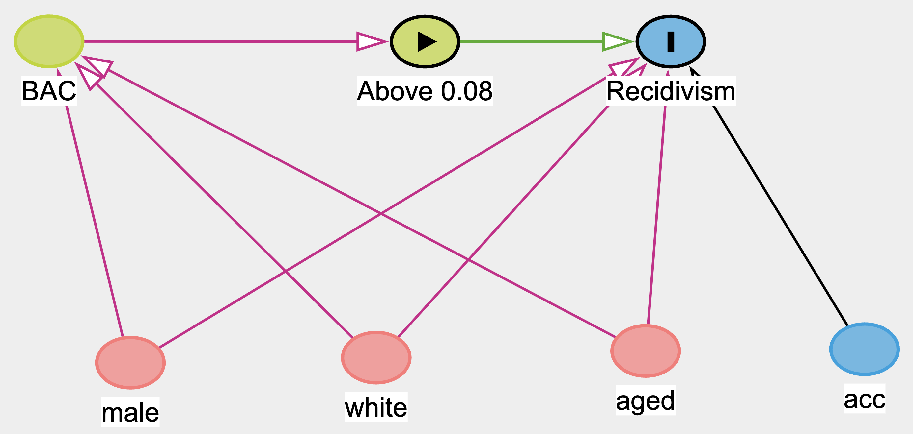

## Research Question

This project studies whether harsher punishments for drunk driving reduce the likelihood that drivers commit another drunk-driving offense in the future. In the United States, drivers whose blood alcohol concentration (BAC) is 0.08 or higher face significantly harsher legal penalties than drivers with BAC levels below this threshold.

We use this legal cutoff to examine whether crossing the 0.08 BAC threshold affects the probability of future drunk-driving recidivism. The key question is whether drivers who fall just above the legal limit and therefore face harsher punishments are less likely to offend again compared to drivers just below the threshold.

## Causal Diagram

The causal structure of this analysis is straightforward. A driver's blood alcohol content (BAC) determines whether they cross the 0.08 legal threshold, which in turn determines whether they receive harsher punishment (the treatment). The treatment then affects the probability of recidivism, which is our outcome of interest.

Demographic characteristics such as gender (male), race (white), age (aged), and whether an accident occurred (acc) may independently affect recidivism. For example, younger males may be more likely to reoffend regardless of the punishment they received. However, these characteristics are determined before the traffic stop and are not caused by the treatment assignment. In a valid RDD, these covariates should be balanced across the cutoff, meaning drivers just above and just below 0.08 should have similar demographic profiles.

We include these variables as controls not because the RDD requires them for identification, but because they can improve precision and because testing whether they are balanced across the cutoff serves as a validity check for our design.

{fig-align="center" width="478"}

## Empirical Strategy

To estimate the causal effect of harsher drunk-driving penalties on recidivism, we use a Regression Discontinuity Design (RDD) based on the legal BAC cutoff of 0.08. Drivers with BAC levels just above this threshold face substantially harsher penalties than those just below it. Because drivers very close to the cutoff are expected to be otherwise similar, comparing outcomes around this threshold allows us to estimate the causal effect of harsher punishment on future drunk-driving offenses.

The running variable is the driver’s BAC level measured as bac_min, the minimum of the two BAC tests administered during the traffic stop. We use the minimum of the two tests because Washington State law assigns punishment based on the lower reading. This means the minimum BAC is the legally binding value that determines whether a driver crosses the 0.08 threshold and faces harsher penalties. Using any other measure, such as the average or the maximum, would not reflect the actual treatment assignment mechanism. The running variable is centered at the cutoff so that 0 corresponds to BAC = 0.08, and a treatment indicator identifies drivers above the threshold. Centering the running variable at the cutoff ensures that the treatment coefficient is directly interpretable as the estimated effect at the threshold, without requiring additional calculation. We restrict the sample to observations with BAC below 0.15. We do this because a second, even harsher penalty takes effect at BAC = 0.15. Including observations above 0.15 would mean our treatment variable captures two different jumps in punishment severity, making it tough to isolate the causal effect of the 0.08 threshold alone.

Our main estimates use the local linear RDD estimator implemented in rdrobust with a triangular kernel and data-driven bandwidth selection. We use a local linear specification rather than higher-order polynomials because as in RDD this polynomial specification may produce unreliable confidence intervals and can generate misleading results. The original Hansen (2015) paper do use higher-order polynomials, but it has since been shown to be problematic. Our binned scatter plot (presented later in the paper) also confirms that the relationship between BAC and recidivism appears approximately linear on both sides of the cutoff, further supporting the local linear approach. We include a quadratic specification only as a robustness check to verify that our results are not sensitive to this modeling choice.

The formal regression model we estimate in the parametric specifications is:

$$Recidivism_i = \beta_0 + \beta_1 \cdot Treat_i + \beta_2 \cdot X_i + \beta_3 \cdot (Treat_i \times X_i) + \varepsilon_i$$

where $Treat_i$ is a binary indicator equal to 1 when the driver's BAC meets or exceeds 0.08, and $X_i$ is the running variable centered at the cutoff. The interaction term $Treat_i \times X_i$ allows the slope of BAC on recidivism to differ on each side of the cutoff. The coefficient $\beta_1$ captures the discontinuous jump in recidivism at the threshold, which is our estimate of the causal effect of harsher punishment.

We use heteroskedasticity-robust standard errors in the parametric models because our outcome variable is binary (0 or 1). With a binary outcome, the variance of the error term depends on the predicted probability and is therefore not constant across observations, violating the assumption of homoskedasticity. Robust standard errors account for this and provide valid inference. We first test for manipulation of the running variable using rddensity. Because the BAC distribution shows heaping at exactly 0.08, we also estimate a donut-hole specification that excludes observations extremely close to the cutoff.

The key identifying assumption of the RDD is that drivers cannot precisely manipulate their BAC levels around the legal threshold. Under this assumption, drivers just above and just below the cutoff are comparable, allowing the discontinuity in punishment to identify the causal effect of harsher penalties on recidivism.

## Data

The data come from traffic stops in Washington State used in Hansen (2015). The dataset contains information on drivers' blood alcohol content (BAC), demographic characteristics, and whether the driver later committed another drunk-driving offense (recidivism). Each driver receives two BAC tests (bac1 and bac2). The dataset also includes demographic variables such as gender (male), race (white), age (aged), and an indicator for whether an accident occurred at the stop (acc). These variables allow us to construct the running variable for the regression discontinuity design and examine whether harsher penalties affect the probability of future drunk-driving offenses.

## Loading Packages and Data

We begin by loading the R packages required for the analysis. The tidyverse package is used for data manipulation and visualization. The here package helps manage file paths so that the project remains reproducible across different computers. The rdrobust and rddensity packages provide tools specifically designed for regression discontinuity analysis, and fixest is used to estimate regression models.

```{r}
library(tidyverse)
library(here)
library(rdrobust)
library(rddensity)
library(fixest)

c_cut <- 0.08

# Load data
dwi_raw <- readr::read_csv("DWI_Data.csv")
```

## Constructing the RDD Variables

```{r}
dwi <- dwi_raw %>%
  mutate(
    bac_min = pmin(bac1, bac2, na.rm = TRUE),
    treat   = as.integer(bac_min >= c_cut),
    x       = bac_min - c_cut
  ) %>%
  filter(!is.na(bac_min), !is.na(recidivism)) %>%
  filter(bac_min < 0.15)

dwi_plot <- dwi %>%
  filter(bac_min >= 0.03, bac_min <= 0.13)

dwi_main <- dwi %>%
  filter(bac_min >= 0.05, bac_min <= 0.11)

dwi_narrow <- dwi %>%
  filter(bac_min >= 0.06, bac_min <= 0.10)

dwi_wide <- dwi %>%
  filter(bac_min >= 0.04, bac_min <= 0.12)
```

To implement the regression discontinuity design, we first construct the key variables used in the analysis. Because each driver receives two BAC tests, we define the running variable using the minimum of the two BAC measurements (bac_min). This is the legally relevant BAC measure used in prosecution and therefore determines whether a driver faces the harsher penalty at the 0.08 cutoff. We then create a treatment indicator (treat) that equals 1 when a driver's BAC is greater than or equal to the legal cutoff of 0.08, and 0 otherwise. The running variable is centered at the cutoff (x = bac_min − 0.08) so that zero corresponds to the threshold. This centering ensures that the intercept of our regression represents the predicted recidivism rate at the cutoff, and the treatment coefficient directly represents the jump at the threshold. Observations with missing BAC or recidivism values are removed, and the sample is restricted to BAC levels below 0.15 to avoid interference from the second legal penalty threshold.

We then define several bandwidth windows around the cutoff for visualization and robustness checks. The main analysis window (0.05–0.11) uses a bandwidth of 0.03 on each side, which provides a large enough sample for reliable estimates while keeping observations close to the cutoff where comparability is strongest. We also test a narrower window (0.06–0.10) to verify that the result holds when we restrict to drivers even more similar to each other, and a wider window (0.04–0.12) to check whether including more data changes the estimate. If the treatment effect is stable across these windows, it provides evidence that the result is not driven by a particular bandwidth choice.

## Running Variable Distribution

Before estimating the regression discontinuity model, we examine the distribution of the running variable near the cutoff. We do this because a sudden spike or drop in the number of observations right at 0.08 could indicate that drivers or officers are manipulating BAC readings to fall on one side of the threshold. If manipulation is present, drivers just above and below the cutoff would no longer be comparable, violating the key RDD assumption.

```{r}
ggplot(dwi_plot, aes(x = bac_min)) +
  geom_histogram(binwidth = 0.001, color = "white") +
  geom_vline(xintercept = c_cut) +
  labs(
    title = "BAC Distribution Near the 0.08 Legal Threshold",
    x = "Blood Alcohol Content (BAC)",
    y = "Count"
  )
```

The histogram shows the frequency of BAC observations in narrow bins around the threshold. The vertical line marks the legal BAC cutoff that determines the treatment assignment in the RDD.

## Manipulation Test

A key assumption of the regression discontinuity design is that individuals cannot precisely manipulate the running variable around the cutoff. To test this, we conduct the McCrary density test using the rddensity package. We run this test because if drivers (or police officers recording BAC values) could systematically push readings just below 0.08, then the people just below the cutoff would not be a valid comparison group for those just above it.

```{r}
dens_08 <- rddensity(X = dwi$bac_min, c = c_cut)
summary(dens_08)
rdplotdensity(dens_08, X = dwi$bac_min)
```

The test does not detect a statistically significant jump in density at the cutoff (p ≈ 0.23), which supports the assumption that systematic manipulation is not occurring. However, the histogram and density plot reveal heaping at exactly 0.08, meaning that many BAC values cluster at the cutoff. This likely reflects rounding or measurement practices in how BAC tests are recorded, rather than strategic manipulation by drivers or officers. While this does not invalidate the RDD, the presence of heaping motivates an additional donut-hole robustness check later in the analysis, where observations extremely close to the cutoff are excluded. If the results are similar with and without these observations, we can be confident that the heaping is not driving our findings.

## RD Plot

We next visualize the relationship between BAC and recidivism using a nonparametric RD plot. We produce this plot before running regressions because it allows us to visually assess two things: whether there is a discontinuity at the cutoff, and whether the relationship between BAC and recidivism appears linear or curved on each side.

```{r}
rdplot(
  y       = dwi_plot$recidivism,
  x       = dwi_plot$bac_min,
  c       = c_cut,
  nbins   = c(20, 20),
  p       = 1,
  kernel  = "tri",
  x.label = "Blood Alcohol Content (BAC)",
  y.label = "Recidivism Rate",
  title   = "Recidivism vs BAC at the 0.08 Legal Threshold"
)
```

The plot groups observations into bins on either side of the 0.08 BAC cutoff and fits local linear trends using a triangular kernel. The vertical line marks the legal threshold where harsher punishments begin. Visually, there appears to be a downward jump in recidivism at the cutoff, suggesting that drivers just above the legal limit may be less likely to reoffend than those just below it. The trends on both sides of the cutoff appear approximately linear, which supports our choice of a local linear model rather than a higher-order polynomial. While this figure provides suggestive evidence of an effect, formal estimation is required to quantify the size and statistical significance of the discontinuity.

## Main RD Estimates

```{r}
rd_main <- rdrobust(
  y           = dwi$recidivism,
  x           = dwi$bac_min,
  c           = c_cut,
  p           = 1,
  kernel      = "tri",
  masspoints = "adjust"
)

rd_plot_window <- rdrobust(
  y          = dwi_plot$recidivism,
  x          = dwi_plot$bac_min,
  c          = c_cut,
  p          = 1,
  kernel     = "tri",
  masspoints = "adjust"
)

rd_h02 <- rdrobust(
  y          = dwi$recidivism,
  x          = dwi$bac_min,
  c          = c_cut,
  p          = 1,
  kernel     = "tri",
  h          = 0.02,
  masspoints = "adjust"
)

rd_h05 <- rdrobust(
  y          = dwi$recidivism,
  x          = dwi$bac_min,
  c          = c_cut,
  p          = 1,
  kernel     = "tri",
  h          = 0.05,
  masspoints = "adjust"
)

summary(rd_main)
summary(rd_plot_window)
summary(rd_h02)
summary(rd_h05)
```

We estimate the causal effect of crossing the BAC threshold using the local linear regression discontinuity estimator implemented in rdrobust. The model uses a triangular kernel and a first-order polynomial, which places more weight on observations closer to the cutoff. We use a triangular kernel because observations nearest to the threshold are the most informative for estimating the discontinuity, and down-weighting those further away reduces bias. The estimator automatically selects the optimal bandwidth around the 0.08 BAC threshold using the method of Calonico, Cattaneo, and Titiunik (2014). We also apply the masspoints = "adjust" option to correct the standard errors for repeated BAC values, since many drivers share exact BAC readings due to measurement precision.

### Bandwidth Sensitivity

To verify that the results are not sensitive to the choice of bandwidth, we estimate the model using alternative bandwidths around the cutoff. We run these checks because the choice of bandwidth involves a tradeoff: narrower bandwidths focus on observations closest to the cutoff where comparability is strongest, but use fewer observations and produce less precise estimates. Wider bandwidths use more data for precision but include observations further from the cutoff who may be less comparable. If the treatment effect is stable across different bandwidths, it provides evidence that the result is not an artifact of a particular sample choice.

```{r}
# Manual bandwidth checks around the cutoff
rd_h02 <- rdrobust(
  y          = dwi$recidivism,
  x          = dwi$bac_min,
  c          = c_cut,
  p          = 1,
  kernel     = "tri",
  h          = 0.02,
  masspoints = "adjust"              # ADDED: corrects SEs for repeated BAC values
)

rd_h05 <- rdrobust(
  y          = dwi$recidivism,
  x          = dwi$bac_min,
  c          = c_cut,
  p          = 1,
  kernel     = "tri",
  h          = 0.05,
  masspoints = "adjust"              # ADDED: corrects SEs for repeated BAC values
)

cat("\n--- rdrobust bandwidth sensitivity ---\n")
cat("\nMain estimate\n");          print(summary(rd_main))
cat("\nPlot-window estimate (0.03 to 0.13)\n"); print(summary(rd_plot_window))
cat("\nSmall bandwidth h = 0.02\n"); print(summary(rd_h02))
cat("\nBig bandwidth h = 0.05\n");   print(summary(rd_h05))
```

In addition to the data-driven bandwidth selected by rdrobust, we estimate models using manual bandwidths of 0.02 and 0.05. We also run the estimation within the plotting window (0.03 to 0.13). Across all specifications, the estimated effect remains negative, supporting the finding that harsher punishment reduces recidivism.

## Co-variate Balance Tests

```{r}
covars <- c("male", "white", "aged", "acc")

balance_tests <- purrr::map_dfr(covars, function(v) {
  yv   <- dwi[[v]]
  keep <- !is.na(yv) & !is.na(dwi$bac_min)
  
  out <- rdrobust(
    y          = yv[keep],
    x          = dwi$bac_min[keep],
    c          = c_cut,
    p          = 1,
    kernel     = "tri",
    masspoints = "adjust"             # ADDED: corrects SEs for repeated BAC values
  )
  
  tibble(
    var = v,
    tau = out$Estimate[1],      # point estimate (unchanged)
    se  = out$se[3],            # FIXED: robust SE (was out$se[1] — conventional)
    p   = out$pv[3]             # FIXED: robust p-value (was out$pv[1] — conventional)
  )
})

balance_tests
```

A key validity condition for the regression discontinuity design is that predetermined characteristics should not change discontinuously at the cutoff. We test this because if demographics such as gender, age, or race differ systematically on either side of 0.08, it would suggest that drivers just above the threshold are fundamentally different from those just below it, undermining the comparability that the RDD relies on.

To test this, we estimate RD models for several covariates, including gender (male), race (white), age (aged), and accident involvement (acc), using each covariate as the outcome variable instead of recidivism. The results show no statistically significant jumps at the cutoff for most variables, suggesting that individuals just above and just below the threshold are comparable. Age shows a marginally significant difference, but the magnitude is small and does not meaningfully threaten the identification strategy. This finding supports the validity of the RDD.

## Donut Hole Robustness

```{r}
dwi_donut <- dwi %>% filter(abs(x) > 0.001)

rd_donut <- rdrobust(
  y          = dwi_donut$recidivism,
  x          = dwi_donut$bac_min,
  c          = c_cut,
  p          = 1,
  kernel     = "tri",
  masspoints = "adjust"
)

summary(rd_donut)
```

Because the distribution of BAC values shows clustering exactly at 0.08, we perform a donut-hole robustness check. We run this check because the heaping at exactly 0.08 could mean that observations at the threshold are affected by rounding or measurement practices that make them different from observations slightly away from the cutoff. This approach excludes observations extremely close to the cutoff (within ±0.001) and re-estimates the RD model.

If the treatment effect is similar with and without these observations, we can conclude that the heaping is not driving our results. If the effect changes substantially, it would suggest that the observations at exactly 0.08 are unusual and should be treated with caution. The donut-hole estimate is approximately -0.02 and statistically significant, compared to -0.011 in the main specification. This suggests the heaping was actually diluting the effect, and the true treatment effect may be slightly larger.

## Parametric Robustness Checks

```{r}
check_main <- feols(
  recidivism ~ treat + x + treat:x,
  data = dwi_main,
  vcov = "hetero"
)

check_narrow <- feols(
  recidivism ~ treat + x + treat:x,
  data = dwi_narrow,
  vcov = "hetero"
)

check_wide <- feols(
  recidivism ~ treat + x + treat:x,
  data = dwi_wide,
  vcov = "hetero"
)

check_cov <- feols(
  recidivism ~ treat + x + treat:x + male + white + aged + factor(year),
  data = dwi_main,
  vcov = "hetero"
)

check_quad <- feols(
  recidivism ~ treat + x + I(x^2) + treat:x + treat:I(x^2),
  data = dwi_main,
  vcov = "hetero"
)

etable(check_main, check_narrow, check_wide, check_cov, check_quad,
       headers = c("Main", "Narrow", "Wide", "Controls", "Quadratic"),
       dict = c(treat = "Above 0.08 Cutoff",
                x = "BAC (centered)",
                "I(x^2)" = "BAC Squared (centered)"),
       title = "Parametric RDD Estimates: Effect of Harsher DUI Punishment on Recidivism")
```

In addition to the nonparametric estimates, we run parametric regressions using feols to provide a complementary set of results. We do this because parametric models allow us to easily add control variables and test alternative functional forms within a familiar regression framework. We estimate the model across three bandwidth windows. The main window (0.05–0.11) balances sample size and comparability. The narrow window (0.06–0.10) restricts to drivers most similar to each other, providing the strongest test of the local RDD assumption. The wide window (0.04–0.12) includes more data to check precision. If the treatment effect is consistent across all three, it supports the robustness of the finding.

We also estimate a model with demographic controls (male, white, aged) and year fixed effects. We include controls not because the RDD requires them for identification, but because their inclusion serves as a specification check. In a valid RDD, adding controls should not meaningfully change the treatment coefficient, since drivers just above and below the cutoff should be similar. If the coefficient on the treatment indicator remains stable after adding controls, it provides further evidence that the design is sound.

Finally, we include a quadratic specification as a robustness check. We do not use this as our preferred model because high-order polynomial specifications in RDD produce noisy estimates with misleading confidence intervals. Our preferred approach is the local linear model, and the quadratic is included only to verify that the direction of the effect is not sensitive to the functional form. Across the main, narrow, and wide bandwidth specifications, the coefficient on treat is consistently negative, ranging from approximately −0.014 to −0.016. This indicates that drivers whose BAC crosses the 0.08 legal threshold are about 1.4–1.6 percentage points less likely to commit another drunk-driving offense compared to drivers just below the cutoff. The estimates remain similar when demographic controls and year fixed effects are included, which confirms that drivers on either side of the cutoff are comparable and that the RDD design is valid.

## Fixed-Bandwidth Parametric Check

```{r}
h_check <- 0.05

dwi_h <- dwi %>%
  filter(abs(x) <= h_check)

check_band <- feols(
  recidivism ~ treat + x + treat:x,
  data = dwi_h,
  vcov = "hetero"
)

etable(check_band,
       dict = c(treat = "Above 0.08 Cutoff",
                x = "BAC (centered)"),
       title = "Fixed-Bandwidth Parametric RDD Estimate (±0.05)")
```

As a final parametric check, we restrict the sample to observations within a symmetric ±0.05 BAC window around the cutoff. We run this as an additional robustness check because the earlier parametric models used pre-defined windows that were not perfectly symmetric. A symmetric bandwidth ensures equal representation from both sides of the cutoff. The coefficient on the treatment indicator (treat) is −0.0187 and statistically significant at the 1% level. This estimate implies that drivers whose BAC crosses the legal threshold are about 1.9 percentage points less likely to commit another drunk-driving offense compared to drivers just below the cutoff. The result is consistent with the earlier nonparametric and parametric estimates.

## Binned RD Visualization

```{r}
bins <- dwi_main %>%
  mutate(bac_bin = round(bac_min, 3)) %>%
  group_by(bac_bin) %>%
  summarise(recidivism = mean(recidivism), .groups = "drop")

grid <- tibble(
  bac_min = seq(0.05, 0.11, by = 0.001)
) %>%
  mutate(
    x = bac_min - c_cut,
    treat = ifelse(bac_min >= c_cut, 1, 0)
  )

grid$yhat <- predict(check_main, newdata = grid)

ggplot(bins, aes(x = bac_bin, y = recidivism)) +
  geom_point() +
  geom_vline(xintercept = c_cut, linetype = "dashed") +
  geom_line(data = grid, aes(x = bac_min, y = yhat)) +
  labs(
    x = "Blood Alcohol Content (binned)",
    y = "Mean Recidivism Rate",
    title = "RD Plot with Fitted Local Linear Line"
  )
```

This figure plots mean recidivism by BAC bin and overlays the fitted local linear regression. We include this figure because it connects the visual evidence to the formal regression output. The graph shows a visible downward jump at the 0.08 cutoff, consistent with the estimated negative effect of harsher penalties on recidivism. The linear fit on each side of the cutoff also confirms that a linear model is an appropriate specification for this data.

## Conclusion

This analysis used a regression discontinuity design (RDD) to estimate the causal effect of harsher drunk-driving penalties at the 0.08 BAC legal threshold on future recidivism. Drivers just above and just below the cutoff are assumed to be comparable, allowing the discontinuity in punishment to identify the treatment effect. We first verified the validity of the design. The density test showed no significant manipulation around the cutoff (p ≈ 0.23), although there is visible heaping at exactly 0.08, likely due to rounding or measurement practices. Covariate balance tests show no meaningful discontinuities in demographic characteristics, suggesting that individuals on either side of the threshold are similar. The baseline nonparametric RDD estimate is negative but not statistically significant. However, when we account for heaping by applying a donut-hole specification, the estimated effect becomes larger and statistically significant. Across additional parametric robustness checks, bandwidth variations, and fixed-window regressions, the estimated impact remains consistently negative, ranging from approximately −0.014 to −0.019.

In terms of magnitude, the parametric estimates suggest that crossing the 0.08 BAC threshold reduces the probability of future recidivism by roughly 1.5–2 percentage points. Given a baseline recidivism rate of approximately 11% among drivers just below the cutoff (as indicated by the intercepts in our parametric models), this represents a relative reduction of roughly 14–18%. In practical terms, for every 100 drivers who face harsher punishment at the threshold, approximately 1.5 to 2 fewer will commit another drunk-driving offense. From a policy perspective, these results suggest that stricter BAC enforcement meaningfully deters repeat drunk-driving offenses. The consistency of the effect across multiple specifications, bandwidths, and functional forms supports the conclusion that this is a credible causal estimate rather than an artifact of any particular modeling choice. These findings are consistent with the broader deterrence literature, which suggests that increasing the severity of penalties can reduce criminal behavior.

### Limitations

Several limitations should be noted. First, the data come exclusively from Washington State, and the results may not generalize to other states with different enforcement practices, legal systems, or driver populations. Second, we analyze only the 0.08 BAC threshold; the effects at the 0.15 aggravated DUI threshold may differ in magnitude or direction. Third, we cannot distinguish which component of the harsher punishment drives the deterrent effect. The penalty at 0.08 includes mandatory license suspension, higher fines, and possible jail time, and our estimates capture the combined effect of all these components. Fourth, while the McCrary test does not detect manipulation, the observed heaping at exactly 0.08 warrants some caution, although the donut-hole results suggest that this heaping does not drive our findings. Finally, our analysis measures whether the driver was recorded as committing another offense, which may undercount actual recidivism if some repeat offenses go undetected.
